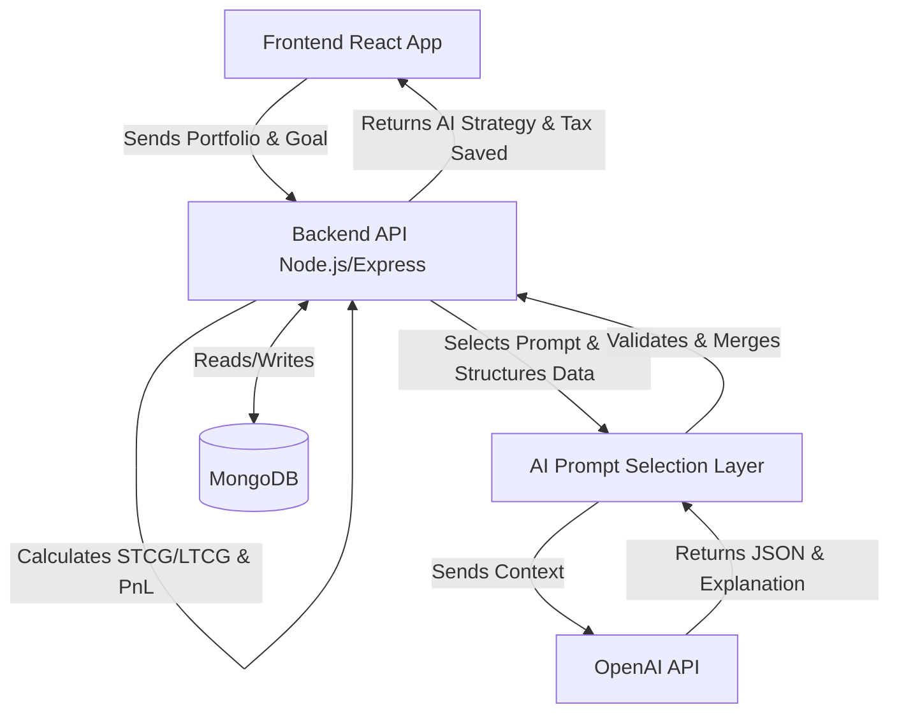

# Tax Optimizer Backend

This is the backend service for the Tax Optimizer application, built with Node.js, Express, and MongoDB. It features an AI orchestration layer that uses OpenAI to generate personalized tax-loss and tax-gain harvesting strategies based on user stock portfolios.

## Setup Instructions
1. Install dependencies: `npm install`
2. Configure environment: Open `.env` and add your `OPENAI_API_KEY`, or any other variables.
3. Start the local MongoDB instance on `mongodb://localhost:27017/tax_optimizer_db`.
4. Run development server: `npm run dev`

## 1. Overall Architecture
- **Frontend (React)**: Handles the UI and API calls to the backend, rendering insights in the Dashboard, Tax Saver, Profile, and Settings pages.
- **Backend (Node.js + Express)**: Contains the core logic, profit/loss computation, AI orchestration, and serves as the intermediary between the Frontend and AI layer.
- **Database (MongoDB)**: Provides persistent storage for Users, Portfolios, Analysis results, and Strategy outputs.
- **AI Layer (LLM using OpenAI API)**: Consumes structured prompt contexts from the backend to generate financial reasoning, explanations, and structured JSON insights.

## 2. End-to-End Data Flow
1. **Frontend → Backend**: The Frontend sends investment data (or a payload) indicating the user goal (e.g. loss harvesting, gain harvesting, gifting).
2. **Backend Processing**: The Backend calculates the holding period (STCG vs LTCG), computes profit/loss, and detects assets eligible for the requested strategy.
3. **AI Prompt Selection**: The Backend selects the specific predefined prompt (e.g., Loss Prompt or Gain Prompt) based on the context.
4. **Backend → AI**: The Backend sends the processed portfolio data alongside the selected prompt.
5. **AI Response**: The AI returns a human-readable text explanation and a structured JSON array of stock recommendations.
6. **Backend Processing AI Output**: The Backend validates the JSON, merges it with its rule-based calculations (estimated tax impact), and finalizes the payload.
7. **Backend → Frontend**: The Backend sends the analysis, AI recommendations, explanation, and a tax savings summary.
8. **Frontend Display**: The Frontend renders tables showing stock-wise insights, AI explanation panels, and strategy summaries.

## 3. Block Diagram

## Modular Design
This application follows the Controller-Service-Route pattern:
- `config/db.js` - Local MongoDB setup and connection handling
- `models/` - Mongoose schemas (`User.js`, `Portfolio.js`)
- `services/taxCalculator.service.js` - Pure utility to calculate holding periods (STCG vs LTCG) and unrealized PnL.
- `services/ai.service.js` - Connects to OpenAI. Forces JSON output containing textual explanations and strategy data.
- `controllers/tax.controller.js` & `strategy.controller.js` - Manages workflows mapping requests through services to formatted output.
- `routes/tax.routes.js` - Defines endpoints and attaches controllers.

